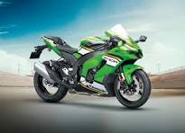

# 🚴 Bike Showroom Website  

This is **Task 3** of my **ApexPlanet Internship**, where I created a **Bike Showroom Website** using **HTML, CSS, and JavaScript**.  

## 📌 Features
- Modern and responsive design  
- Interactive layout with images of bikes  
- Stylish navigation bar  
- Clean CSS with hover effects  

## 🛠️ Tech Stack
- **HTML5** – Structure  
- **CSS3** – Styling  
- **JavaScript** – Interactivity  

## 📷 Screenshots
### Homepage  
  

### Bike Showcase  
  

## 🚀 How to Run
1. Clone the repository  
   ```bash
   git clone https://github.com/Sudharsan-gr/Bike_Showroom.git
